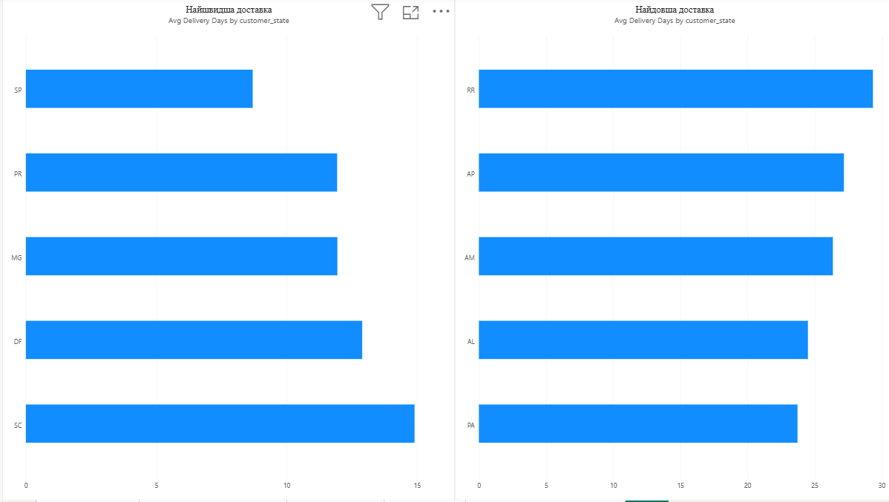
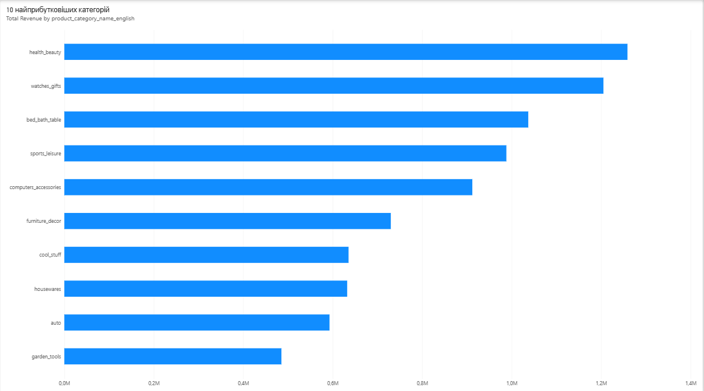
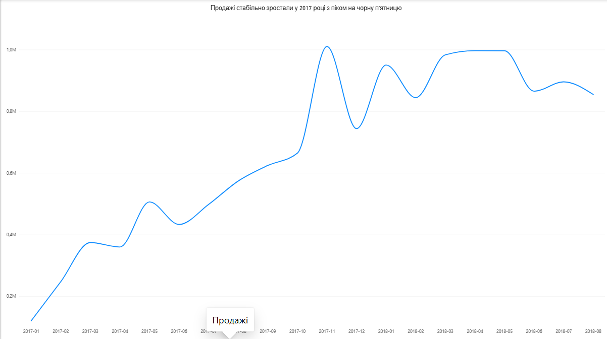
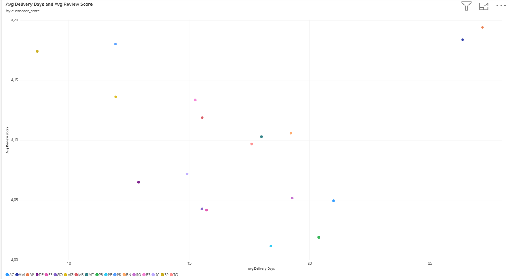
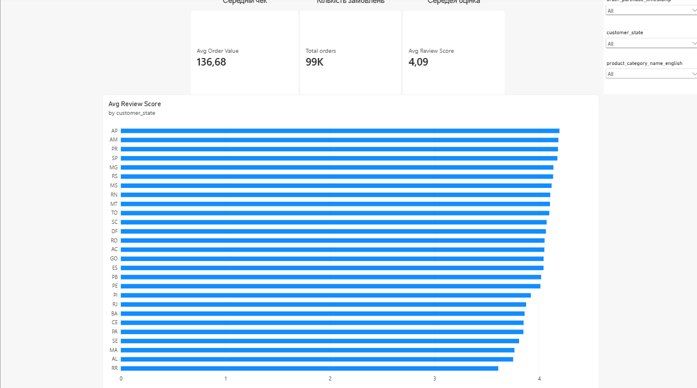
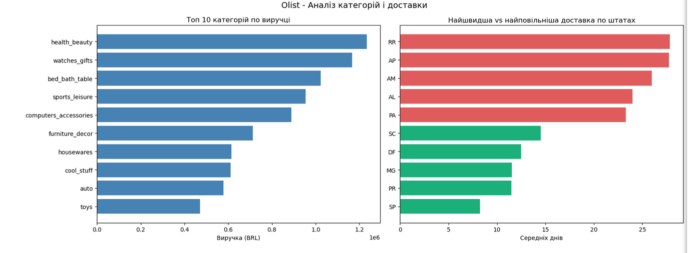
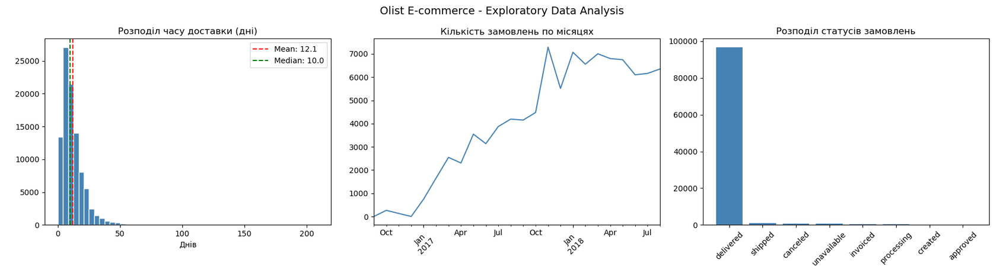

# Brazilian E-commerce Sales Analysis

## Опис проєкту
Аналіз даних бразильського маркетплейсу Olist за 2017-2018 роки.
Датасет містить 99,441 замовлень з інформацією про клієнтів,
товари, продавців і доставку.

## Бізнес-питання
1. Які категорії товарів найприбутковіші?
2. В яких регіонах проблеми з доставкою?
3. Як змінювались продажі у 2017-2018?
4. Чи залежить задоволеність клієнта від швидкості доставки?

## Ключові висновки
- **Health & Beauty** - лідер виручки з показником 1.2M BRL
- **Пік продажів** у листопаді 2017 (Чорна п'ятниця) - зростання на 60%
- **Медіана доставки 10 днів** vs середня 12.1 - через аномальні
  затримки у віддалених штатах
- **Несподіваний висновок:** час доставки не корелює з оцінкою
  задоволеності. Штат RR (28 днів) має вищу оцінку ніж деякі
  швидкі регіони — клієнти у віддалених регіонах мають інші очікування

## Інструменти
| Інструмент | Використання |
|---|---|
| Python (Pandas, Seaborn) | Очищення даних, EDA, візуалізація |
| Power BI | Інтерактивний дашборд |
| Git / GitHub | Версійний контроль |

## Дашборди Power BI

## EDA Графіки

## Як запустити
1. Завантаж датасет: [Olist на Kaggle](https://www.kaggle.com/datasets/olistbr/brazilian-ecommerce)
2. Помісти CSV файли в `data/raw/`
3. Встанови бібліотеки: `pip install -r requirements.txt`
4. Відкрий `notebooks/olist_analysis.ipynb` в Jupyter

## Дані
Датасет: [Brazilian E-Commerce Public Dataset by Olist](https://www.kaggle.com/datasets/olistbr/brazilian-ecommerce)
Період: Жовтень 2016 - Серпень 2018
Розмір: 99,441 замовлень
